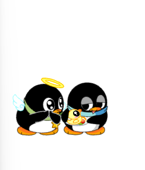
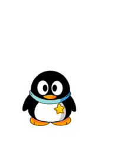

# Desktop QQ Animal

一个基于 Electron + React 的桌面宠物应用，集成了 AI Agent 联动功能。


## 效果展示




## 创意来源

本项目的创意参考了 [qqpet_automation](https://github.com/xuemian168/qqpet_automation)，在此表示感谢。

## 版权声明

**软件内的 QQ 宠物企鹅形象版权归腾讯公司所有。**

本项目仅用于学习和研究目的，请勿用于任何商业用途或违法行为。如有侵权，请联系删除。

## 功能特性

- 桌面宠物：QQ 企鹅形象，支持 Egg → Kid → Adult 三阶段成长
- AI 交互：接入 OpenAI 兼容 API，宠物可以自主对话和行动
- 能量系统：Token 余额转化为宠物能量，影响成长速度
- Agent 联动：支持 OpenCode / Claude Code / Codex 插件，宠物会跟随你的编码活动做出反应
- 托盘常驻：最小化到系统托盘，后台陪伴

## 快速开始

### 1. 克隆项目

```bash
git clone https://github.com/your-username/desktop-qq-animal.git
cd desktop-qq-animal
```

### 2. 安装依赖

```bash
npm install
```

### 3. 配置 API Key

在项目根目录创建 `.env` 文件：

```env
OPENAI_BASE_URL=https://api.openai.com/v1
OPENAI_API_KEY=sk-your-api-key-here
OPENAI_MODEL=gpt-4o-mini
```

支持任何 OpenAI 兼容格式的 API（通过 `.env` 配置 `OPENAI_BASE_URL`、`OPENAI_API_KEY`、`OPENAI_MODEL`）。

### 4. 启动应用

```bash
npm run start
```

首次启动会要求选择宠物性别（GG/MM），之后宠物就会出现在桌面上。

## Agent 插件系统

宠物可以跟随你的编码活动做出反应。当你在终端中使用 AI Agent 编码时，宠物会自动播放对应动画 — 写代码时敲键盘，完成任务时开心，出错时摔倒。

### 工作原理

```
Agent 插件 → 写入事件文件 → Pet App 轮询读取 → 播放动画 + 气泡
```

插件将 Agent 的生命周期事件（会话开始、工具调用、完成、出错等）写入本地文件 `~/.qq-pet/events.jsonl`，宠物应用每 200ms 轮询读取并触发动画。

### 一键安装

右键托盘图标 → **"安装 Agent 插件"** 即可自动配置所有支持的 Agent。

### 支持的 Agent

| Agent | 集成方式 | 说明 |
|-------|---------|------|
| [OpenCode](https://opencode.ai) | JS 插件 | 安装到 `~/.config/opencode/plugins/` |
| [Claude Code](https://docs.anthropic.com/claude-code) | Command Hook | 写入 `~/.claude/settings.json` |
| [Codex](https://github.com/openai/codex) | Command Hook | 写入 `~/.codex/hooks.json` |

### 支持的事件

| 事件 | 触发时机 | 宠物反应 |
|------|---------|---------|
| `session_start` | Agent 会话开始 | 欢迎动画 + "主人开始工作啦！" |
| `tool_start` | 工具调用开始 | 敲键盘动画 + "在执行任务~" |
| `tool_end` | 工具调用完成 | 开心动画 + "完成啦！" |
| `error` | 出错 | 摔倒动画 + "出错了..." |
| `session_end` | 会话结束 | 站立动画 + "辛苦了主人~" |
| `idle` | Agent 空闲 | 随机互动 |

### 手动安装

如果自动安装不生效，可以手动配置：

**OpenCode** — 复制 `plugins/opencode-pet.js` 到 `~/.config/opencode/plugins/`

**Claude Code** — 在 `~/.claude/settings.json` 中添加 hooks，参考 `plugins/claude-hook.js`

**Codex** — 在 `~/.codex/hooks.json` 中添加 hooks，参考 `plugins/codex-hook.js`

## 项目结构

```
src/
  main.ts              # Electron 主进程
  main/
    ai.ts              # AI 对话逻辑
    tokenLedger.ts     # Token 余额管理
    eventPoller.ts     # Agent 事件轮询
    pluginInstaller.ts # 插件安装器
  preload.ts           # 预加载脚本
  renderer/
    components/        # React 组件
    hooks/             # 自定义 Hooks
    config/            # 动画配置、文案
plugins/               # Agent 插件模板
public/                # 静态资源（SWF 动画）
```

## 许可证

MIT License

## 免责声明

- 本项目仅供学习交流使用
- QQ 宠物企鹅形象版权归腾讯公司所有
- 请勿将本项目用于任何商业用途
- 使用本项目产生的一切后果由使用者自行承担
